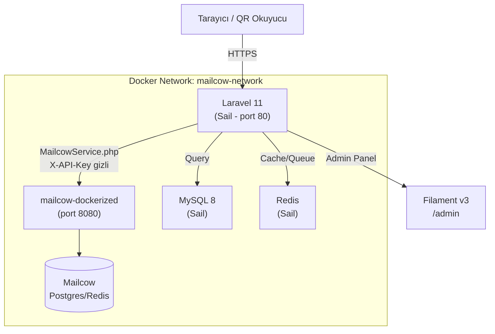

## Teknoloji Yığını Önerisi

Senin önerinle **tam örtüşüyor**, küçük ek önerilerle:

| Katman | Seçim | Gerekçe |
|---|---|---|
| **Backend** | Laravel 11 | PHP ekosisteminin en olgun çerçevesi |
| **Admin Panel** | Filament v3 | Laravel ile en derin entegrasyon; tablo/form bileşenleri hazır |
| **Rol/İzin** | Spatie Laravel Permission | Endüstri standardı, Filament ile native entegrasyon |
| **Docker** | Laravel Sail | Mailcow zaten Docker'da; Sail ile aynı ağda çalışmak kolay |
| **Veritabanı** | **MySQL 8.0** | Sail varsayılanı, Filament ile sorunsuz çalışır |
| **Cache/Queue** | **Redis** | Mailcow API yanıtlarını cache'lemek için; kuyruk (activation mail) için |
| **QR Kod** | `SimpleSoftwareIO/simple-qrcode` | Blade şablonlarında SVG/PNG QR üretimi |
| **Auth** | Laravel Sanctum + Fortify | Web oturumu + API token (öğrenci karekod girişi için) |
| **Frontend** | Blade + Tailwind CSS | Mevcut pastel tasarımı korur, Filament de Tailwind kullanır |

> Alternatif: PostgreSQL 16 (JSON depolama ve karmaşık sorgularda üstündür). Ancak mevcut projenin ihtiyaçları için MySQL 8 daha pratiktir.

---

## Veritabanı Şeması

```mermaid
erDiagram
    users {
        bigint id PK
        string name
        string email UK
        string password
        boolean is_active
        timestamp email_verified_at
        timestamp created_at
    }
    roles { bigint id PK; string name; string guard_name }
    model_has_roles { bigint role_id; string model_type; bigint model_id }
    bayiler {
        bigint id PK
        bigint user_id FK
        string il
        int okul_kotasi
        string aktivasyon_token
        timestamp aktif_at
    }
    okullar {
        bigint id PK
        bigint bayi_id FK
        bigint yonetici_user_id FK
        string ad
        string adres
        string telefon
        boolean is_active
    }
    siniflar {
        bigint id PK
        bigint okul_id FK
        bigint ogretmen_user_id FK
        string ad
        string brans
    }
    ogrenciler {
        bigint id PK
        bigint user_id FK
        bigint sinif_id FK
        string mailbox_local_part
        int mailbox_quota_mb
        string qr_token
        text qr_svg
    }
    veliler {
        bigint id PK
        bigint user_id FK
    }
    ogrenci_veli {
        bigint ogrenci_id FK
        bigint veli_id FK
    }
    aktivasyon_tokenleri {
        bigint id PK
        bigint user_id FK
        string token UK
        string tip
        timestamp expires_at
        timestamp kullanildi_at
    }
    users ||--o{ bayiler : "bayi profili"
    users ||--o{ ogrenciler : "ogrenci profili"
    users ||--o{ veliler : "veli profili"
    bayiler ||--o{ okullar : "okul sahipliği"
    okullar ||--o{ siniflar : "sınıf"
    siniflar ||--o{ ogrenciler : "kayıtlı öğrenci"
    ogrenciler }o--o{ veliler : "ogrenci_veli"
```

---

## Mimari Akış



---

## Rol Hiyerarşisi ve Filament Panel Yapısı

| Rol | Filament Paneli | Görme Yetkisi |
|---|---|---|
| `super_admin` | `/admin` | Her şey |
| `admin` | `/admin` | Bayiler, okullar, kullanıcılar |
| `bayi` | `/panel` | Kendi okulları, yöneticiler |
| `yonetici` | `/panel` | Kendi okulu, öğretmenler |
| `ogretmen` | `/panel` | Kendi sınıfları, öğrenciler |
| `veli` | `/veli` | Sadece kendi çocuklarının özeti (özel Blade) |
| `ogrenci` | `/giris` | QR ile giriş → özel Blade görünüm |

---

## Adım Adım Uygulama Planı

### Adım 1 — Docker / Sail Altyapısı
**Hedef Dosyalar:** `docker-compose.yml`, `.env`, `composer.json`

- Mevcut `alfabemail/` içeriğini (`index.html`, `portal/`, `src/`, `server.js`) `_legacy/` alt klasörüne taşı
- `composer create-project laravel/laravel .` ile Laravel 11 kur (mevcut klasöre)
- `composer require laravel/sail --dev` ile Sail ekle
- `php artisan sail:install` ile MySQL + Redis seç
- `docker-compose.yml` içine mailcow ağını **external network** olarak ekle:
  ```yaml
  networks:
    mailcow-network:
      external: true
      name: mailcow-network   # mailcow-dockerized'ın oluşturduğu ağ adı
    sail:
      driver: bridge
  services:
    laravel.test:
      networks:
        - sail
        - mailcow-network
  ```
- `.env` içine Mailcow değişkenlerini ekle:
  ```
  MAILCOW_API_BASE_URL=http://mailcow-postfix:80
  MAILCOW_API_KEY=
  MAILCOW_DOMAIN=alfabe.co
  MAILCOW_DEFAULT_QUOTA_MB=2048
  ```

**Doğrulama:** `sail up -d` → `sail artisan about`

---

### Adım 2 — Rol / İzin Sistemi (Spatie)
**Hedef Dosyalar:** `app/Models/User.php`, `database/migrations/`, `database/seeders/`

- `composer require spatie/laravel-permission`
- Migration ve seeder çalıştır
- `User` modeline `HasRoles` trait ekle
- `RolesSeeder.php` oluştur:
  ```
  Roller: super_admin, admin, bayi, yonetici, ogretmen, veli, ogrenci
  İzinler: bayileri-yonet, okullari-yonet, ogretmenleri-yonet,
           ogrencileri-yonet, mailbox-olustur, rapor-gor, kota-sor
  ```
- Her rol için izin atamaları tanımla (hiyerarşik: alt rol ebeveynin bir alt kümesidir)
- `DatabaseSeeder.php`'ye demo kullanıcıları ekle (README'deki demo kimlik bilgileriyle)

**Doğrulama:** `sail artisan db:seed` → kullanıcı rolleri kontrol

---

### Adım 3 — Veritabanı Migration'ları
**Hedef Dosyalar:** `database/migrations/`

Sırayla migration dosyaları:
1. `create_bayiler_table`
2. `create_okullar_table`
3. `create_siniflar_table`
4. `create_ogrenciler_table`
5. `create_veliler_table`
6. `create_ogrenci_veli_table`
7. `create_aktivasyon_tokenleri_table`

Model dosyaları: `app/Models/{Bayi, Okul, Sinif, Ogrenci, Veli, AktivasyonToken}.php`
Her modelde uygun `belongsTo`/`hasMany`/`belongsToMany` ilişkileri.

**Doğrulama:** `sail artisan migrate:fresh --seed`

---

### Adım 4 — MailcowService (PHP Karşılığı)
**Hedef Dosyalar:** `app/Services/MailcowService.php`, `app/Http/Controllers/MailcowProxyController.php`, `routes/api.php`

`MailcowService.php` (mevcut `student_mail_service.js` mantığını PHP'ye taşır):
```
+ slugify(string): string           — Türkçe karakter normalizasyonu
+ createMailboxLocalPart(array): string
+ createStudentMailbox(array): array — Mailcow API'ye POST atar
+ deleteMailbox(string): void
+ getMailboxQuota(string): array
+ listMailboxes(): array
```

`MailcowProxyController.php`:
- `GET /api/mailcow/status`
- `POST /api/mailcow/mailbox` (öğrenci oluştur)
- `DELETE /api/mailcow/mailbox/{email}`
- `GET /api/mailcow/quota/{email}`

Route middleware: `auth:sanctum` + Spatie `permission:mailbox-olustur`

CORS sorunu: Frontend artık `/api/mailcow/*` yerine aynı origin'den Laravel'e istek atar → **CORS tamamen ortadan kalkar**.

**Doğrulama:** `sail artisan tinker` → `app(MailcowService::class)->listMailboxes()`

---

### Adım 5 — Filament v3 Kurulumu
**Hedef Dosyalar:** `app/Filament/`, `app/Providers/Filament/`

- `composer require filament/filament`
- `php artisan filament:install --panels`
- **İki panel** oluştur:
  - `AdminPanelProvider` → `/admin` (super_admin, admin)
  - `PortalPanelProvider` → `/panel` (bayi, yonetici, ogretmen)

**Filament Resources:**

| Resource | Panel | Görünür | CRUD Sınırlaması |
|---|---|---|---|
| `BayiResource` | admin | admin+ | Filament scope: kendi kayıtları |
| `OkulResource` | portal | bayi+ | `->where('bayi_id', auth user bayi id)` |
| `SinifResource` | portal | yonetici+ | okula göre scope |
| `OgretmenResource` | portal | yonetici+ | okula göre scope |
| `OgrenciResource` | portal | ogretmen | sınıfa göre scope |

Her Resource'a `canAccess()` guard ekle (Spatie role check).

Filament `Action` olarak:
- `MailboxOlusturAction` — Mailcow API entegrasyonu
- `YakaKartiBastirAction` — QR kod PDF/print
- `AktivasyonMailiGonderAction` — Token oluştur + mail gönder

**Doğrulama:** `/admin` ve `/panel` route'larına giriş; role'e göre menü kontrolü

---

### Adım 6 — Blade Şablonları
**Hedef Dosyalar:** `resources/views/`, `resources/js/`, `public/`

Mevcut HTML dosyaları → Blade dönüşümü:

| Kaynak | Hedef Blade |
|---|---|
| `index.html` | `resources/views/welcome.blade.php` |
| `portal/ogrenci.html` | `resources/views/ogrenci/giris.blade.php` |
| `portal/veli.html` | `resources/views/veli/dashboard.blade.php` |
| `portal/ogretmen.html` | `resources/views/ogretmen/panel.blade.php` (Filament ile değişir) |
| `portal/yonetici.html` | `resources/views/yonetici/panel.blade.php` (Filament ile değişir) |
| `portal/bayi.html` | Filament Portal Panel |
| `portal/admin.html` | Filament Admin Panel |
| `portal/super_admin.html` | Filament Admin Panel |

CSS/JS → `public/assets/` klasörüne; Blade'de `asset()` helper'ı ile referans.

`demo-auth.js` devre dışı — Laravel Auth sistemi ile değiştirilir.

`routes/web.php`:
```
GET  /                → welcome (penguen animasyon)
GET  /giris           → ogrenci karekod giriş
GET  /veli/dashboard  → veli özet
POST /ogrenci/qr-auth → QR token doğrulama
```

---

### Adım 7 — Penguen Animasyonu Düzeltmesi
**Hedef Dosya:** `resources/views/welcome.blade.php`

Mevcut sorun: Penguen elinde mail taşımıyor gibi görünüyor; "son bakış" efekti yok.

Değişiklikler:
1. **Mail konumu**: `.mail.one` ve `.mail.two` elementlerini sol kanada (`.wing-left` yakınına) taşı — penguen elinde postalar tutuyormuş gibi görünsün
2. **Son bakış keyframe**: `penguin-walk` animasyonuna kapıya girerken `rotateY(20deg)` ekle — geriye dönüp baktığı efekt
3. **Kanat pozisyonu**: Sol kanat "taşıma" pozisyonuna gelecek şekilde `rotate(-60deg)` ile yukarı kaldırılmış olsun
4. **Animasyon sıralaması** (9 saniyelik döngü):
   - `0–55%`: Soldan yürüyüş, kanat sallama, mailleri taşıma
   - `55–72%`: Kapıya yaklaşma, yavaşlama
   - `72–80%`: **Son bakış** — hafif `rotateY` ile geriye dönüp bir bakış
   - `80–90%`: Kapıya giriş, scale küçülme
   - `90–100%`: Tamamen kaybolma (opacity: 0)

---

### Adım 8 — Aktivasyon Sistemi
**Hedef Dosyalar:** `app/Mail/`, `app/Notifications/`, `app/Http/Controllers/ActivationController.php`

- `AktivasyonMaili` Mailable: Blade şablonuyla davet e-postası
- `ActivationController::activate()`: Token doğrula → şifre oluştur → kullanıcıyı aktif et
- Token süresi: 48 saat (configurable)
- Mail gönderimi: Laravel Queue (Redis driver) ile arka planda

---

### Adım 9 — README Güncellemesi
**Hedef Dosya:** `README.md`

Mevcut README içeriğini koru + aşağıdaki bölümleri güncelle/ekle:
- Teknoloji Yığını bölümü
- Docker kurulum talimatları (`sail up`, network setup)
- Rol/izin tablosu
- Veritabanı şema özeti
- Mailcow API proxy endpoint listesi
- Legacy dosyaların `_legacy/` altında arşivlendiği notu

---

## Doğrulama / Definition of Done

| Adım | Kontrol |
|---|---|
| 1 | `sail up -d` hatasız başlar; `sail artisan about` MySQL+Redis bağlantısını gösterir |
| 2 | `sail artisan permission:cache-reset` başarılı; 7 rol DB'de görünür |
| 3 | `sail artisan migrate:fresh --seed` başarılı; tüm tablolar ve demo veriler oluşur |
| 4 | `POST /api/mailcow/mailbox` isteği Mailcow'a iletilir (veya yapılandırma eksik hatası döner) |
| 5 | `/admin` super_admin ile giriş; `/panel` ogretmen ile giriş; diğer rollerde erişim engeli |
| 6 | `/` route'u penguen animasyonlu welcome sayfası açar |
| 7 | Penguen mailleri taşır, kapıda geriye bakar, içeri girer ve kaybolur |
| 8 | Aktivasyon linki içeren mail kuyruğa alınır |
| 9 | README güncel; eski JS dosyaları `_legacy/` altında arşivlenmiş |
